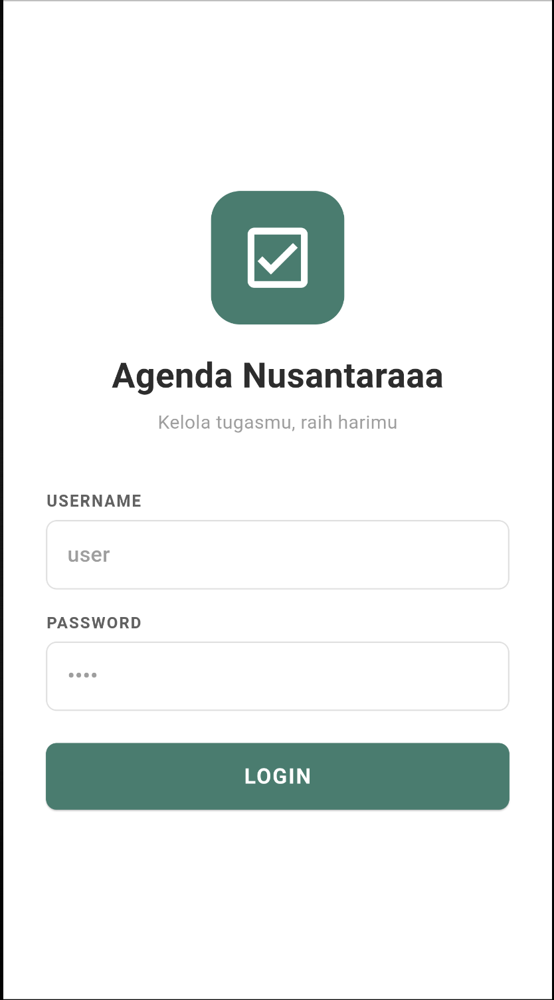
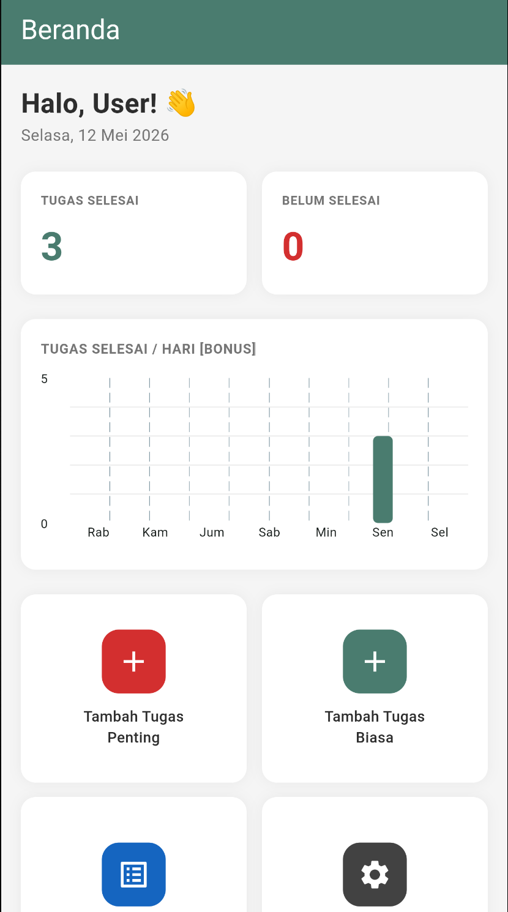
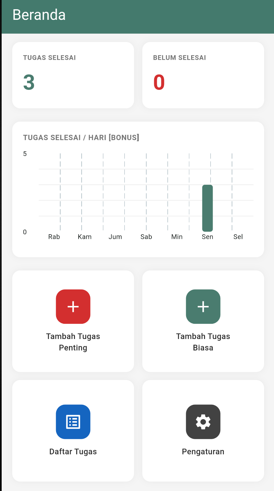
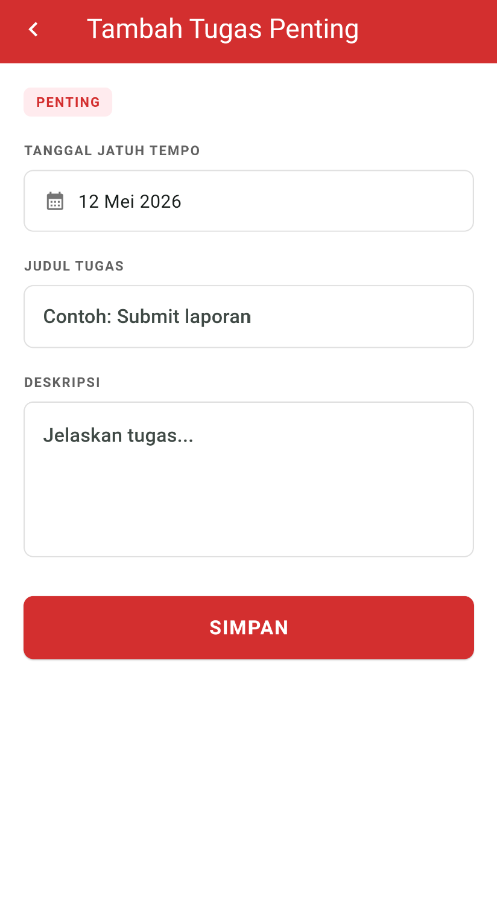
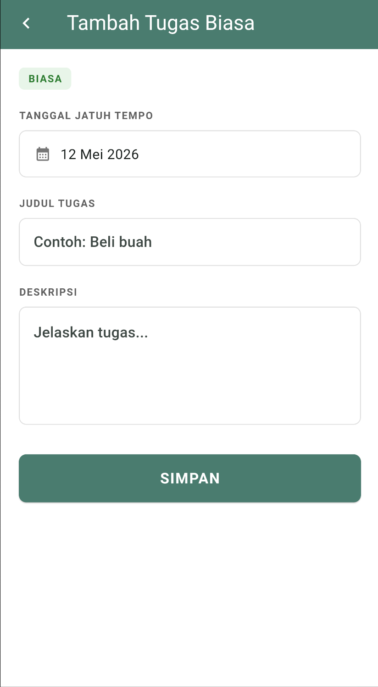
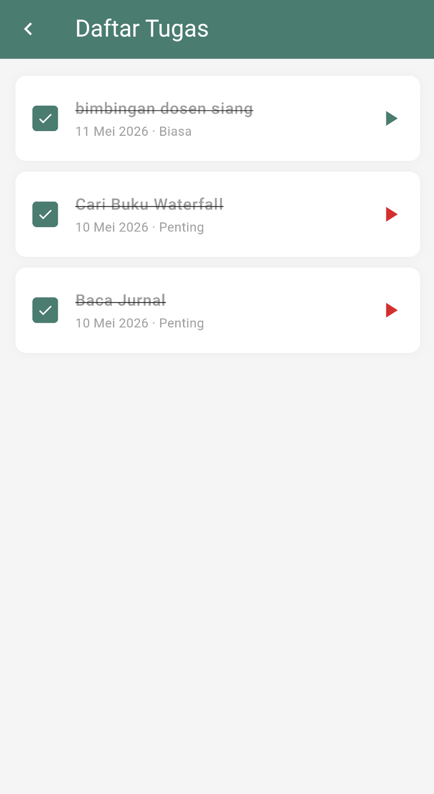
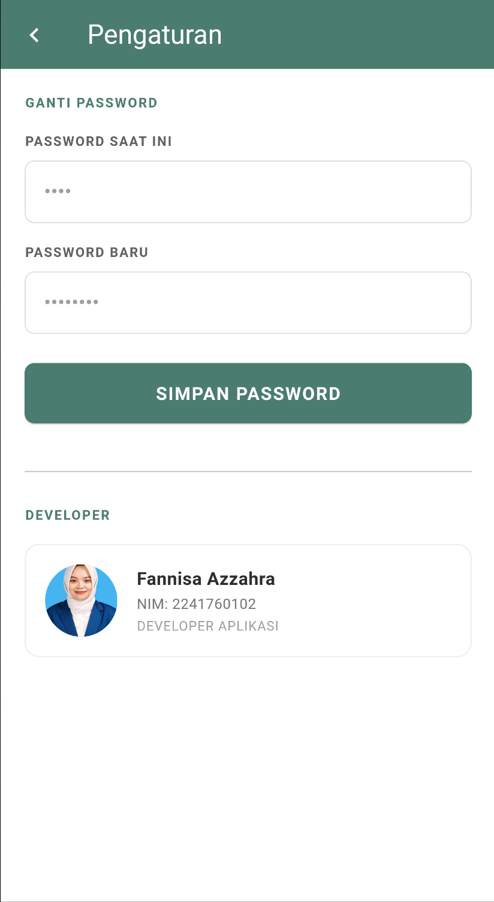

# Agenda Nusantara

Agenda Nusantara adalah aplikasi Flutter untuk mengelola tugas harian secara lokal. Aplikasi ini memakai SQLite sebagai penyimpanan data, menyediakan login sederhana, pemisahan tugas penting dan biasa, daftar tugas dengan status selesai, serta ringkasan progres dalam bentuk statistik dan grafik.

## Fitur Utama

- Login dengan akun bawaan yang disimpan di database lokal.
- Menambah tugas ke dua kategori: `penting` dan `biasa`.
- Memilih tanggal jatuh tempo, judul, dan deskripsi tugas.
- Melihat daftar seluruh tugas dalam satu layar.
- Menandai tugas selesai atau belum selesai.
- Menghapus tugas dengan geser ke kiri dan konfirmasi.
- Melihat statistik tugas selesai dan belum selesai.
- Melihat grafik jumlah tugas selesai per hari selama 7 hari terakhir.
- Mengganti password akun dari menu pengaturan.
- Menampilkan profil developer pada halaman pengaturan.

## Screenshot Aplikasi

Berikut beberapa tampilan utama aplikasi beserta fungsinya.

### Login

Halaman ini digunakan untuk masuk ke aplikasi menggunakan akun bawaan atau password yang sudah diubah.

<p align="center">
	
</p>

### Beranda

Beranda menampilkan ringkasan tugas, grafik progres, dan tombol navigasi ke fitur utama.

<p align="center">
	
</p>

Bagian atas beranda menampilkan sapaan, ringkasan tugas, dan grafik progres.

<p align="center">
	
</p>

Bagian bawah beranda menampilkan tombol navigasi ke fitur utama.

### Tambah Tugas Penting

Form ini dipakai untuk membuat tugas dengan prioritas penting.

<p align="center">
	
</p>

### Tambah Tugas Biasa

Form ini dipakai untuk membuat tugas kategori biasa.

<p align="center">
	
</p>

### Daftar Tugas

Halaman ini menampilkan seluruh tugas, status selesai, serta opsi hapus dengan swipe.

<p align="center">
	
</p>

### Pengaturan

Di halaman ini pengguna dapat mengganti password dan melihat informasi developer.

<p align="center">
	
</p>

## Teknologi yang Dipakai

- Flutter
- Dart
- SQLite melalui `sqflite`
- `intl` untuk format tanggal Bahasa Indonesia
- `fl_chart` untuk grafik progres

## Cara Menjalankan

1. Pastikan Flutter sudah terpasang dan environment siap.
2. Jalankan perintah berikut di root project:

```bash
flutter pub get
flutter run
```

3. Pilih device atau emulator yang ingin digunakan.

## Akun Default

Aplikasi ini membuat user bawaan saat database pertama kali dibuat.

- Username: `user`
- Password: `user`

## Struktur Singkat Project

```text
lib/
	main.dart
	database/
		database_helper.dart
	models/
		task.dart
	screens/
		login_screen.dart
		home_screen.dart
		add_task_screen.dart
		task_list_screen.dart
		settings_screen.dart
assets/
	foto.jpg
```

## Alur Aplikasi

1. Pengguna login menggunakan akun bawaan atau password yang sudah diganti.
2. Setelah masuk, pengguna melihat ringkasan tugas, grafik progres, dan menu navigasi.
3. Tugas baru ditambahkan dari beranda ke kategori penting atau biasa.
4. Semua data tugas tersimpan secara lokal di SQLite.
5. Password akun bisa diubah dari menu pengaturan.

## Catatan

- Data aplikasi tersimpan lokal di perangkat, jadi tidak membutuhkan server.
- Grafik pada beranda menghitung tugas yang ditandai selesai berdasarkan tanggal penyelesaian.
- Folder `build/` adalah hasil kompilasi Flutter dan biasanya tidak perlu diubah manual.
